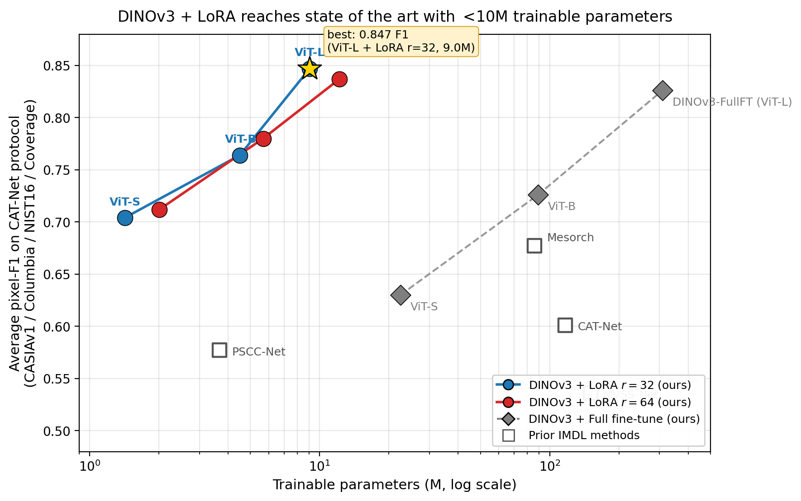

# DINOv3 Beats Specialized Detectors: A Simple Foundation Model Baseline for Image Forensics

[](LICENSE)
[](https://www.python.org/)

> **TL;DR** — Freeze DINOv3, inject LoRA on QKV, attach a 3-conv head. With only **9.0 M trainable parameters**, this simple recipe outperforms all prior specialized detectors on both the CAT-Net and MVSS-Net evaluation protocols.

<p align="center">
  
  &nbsp;&nbsp;→&nbsp;&nbsp;
  
</p>
<p align="center"><em>Left: tampered image. Right: predicted forgery mask.</em></p>

---

## Highlights

- **State-of-the-art** avg pixel-F1 on CAT-Net protocol: **0.847** (vs. 0.677 prior SOTA)
- Only **9.0 M trainable parameters** — LoRA on QKV + 3-conv head
- **Frozen backbone** — no catastrophic forgetting, no collapse on small datasets
- **Simple architecture** — no specialized forensic components, no frequency analysis, no attention manipulation

---

## Architecture

<p align="center">
  
</p>

The backbone (DINOv3 ViT, frozen) extracts patch-level features via `get_intermediate_layers`. LoRA matrices injected into every QKV projection allow task-specific attention adaptation with minimal parameters. A lightweight 3-conv segmentation head (Conv→BN→ReLU ×2, then Conv1×1) predicts the pixel-level manipulation mask, upsampled to input resolution via bilinear interpolation.

---

## Results

### CAT-Net Protocol (4-dataset avg pixel-F1)
*Training: CASIA-v2 + FantasticReality + IMD2020 + TampCOCO. Test: CASIAv1 / Columbia / NIST16 / Coverage.*

| Method | Params | CASIAv1 | Columbia | NIST16 | Coverage | **Avg F1** |
|---|---|---|---|---|---|---|
| PSCC-Net | 3.7 M | — | — | — | — | 0.577 |
| Mesorch (AAAI'25) | 85.8 M | — | — | — | — | 0.677 |
| CAT-Net | 116.7 M | — | — | — | — | 0.601 |
| MVSS-Net | 150.5 M | — | — | — | — | 0.536 |
| **Ours ViT-S LoRA r=32** | 1.4 M | 0.787 | 0.923 | 0.462 | 0.646 | **0.704** |
| **Ours ViT-B LoRA r=64** | 5.7 M | 0.840 | 0.938 | 0.565 | 0.715 | **0.780** |
| **Ours ViT-L LoRA r=32** | 9.0 M | 0.907 | 0.941 | 0.636 | 0.905 | **0.847** |
| **Ours ViT-L LoRA r=64** | 12.2 M | 0.908 | 0.927 | 0.633 | 0.882 | **0.837** |

### MVSS-Net Protocol (5-dataset avg pixel-F1)
*Training: CASIA-v2 only (5,123 images). Test: CASIAv1 / Columbia / NIST16 / Coverage / IMD2020.*

| Method | CASIAv1 | Columbia | NIST16 | Coverage | IMD2020 | **Avg F1** |
|---|---|---|---|---|---|---|
| **Ours ViT-L LoRA r=32** | 0.867 | 0.943 | 0.589 | 0.822 | 0.628 | **0.770** |
| **Ours ViT-L LoRA r=64** | 0.873 | 0.915 | 0.621 | 0.820 | 0.641 | **0.774** |
| FullFT ViT-L *(collapse)* | 0.852 | 0.842 | 0.532 | 0.679 | 0.499 | *0.681* |
| FullFT ViT-S *(collapse)* | 0.209 | 0.364 | 0.189 | 0.154 | 0.186 | *0.221* |

> FullFT converges to trivial all-zero predictions early in training on small datasets — see `assets/fullft_collapse_curves.png`. LoRA avoids this via low-rank regularization.

### Parameter Efficiency

<p align="center">
  
</p>

---

## Pretrained Weights

| Config | Protocol | Avg F1 | Trainable params | Download |
|---|---|---|---|---|
| ViT-L LoRA r=32 | CAT | **0.847** | 9.0 M | [Google Drive](https://drive.google.com/drive/folders/1X9EZUnvg7FLBvGgR_V7mViZUhiD5r7YT) |
| ViT-L LoRA r=64 | CAT | 0.837 | 12.2 M | [Google Drive](https://drive.google.com/drive/folders/1X9EZUnvg7FLBvGgR_V7mViZUhiD5r7YT) |
| ViT-L LoRA r=64 | MVSS | **0.774** | 12.2 M | [Google Drive](https://drive.google.com/drive/folders/1X9EZUnvg7FLBvGgR_V7mViZUhiD5r7YT) |
| ViT-L LoRA r=32 | MVSS | 0.770 | 9.0 M | [Google Drive](https://drive.google.com/drive/folders/1X9EZUnvg7FLBvGgR_V7mViZUhiD5r7YT) |
| ViT-B LoRA r=64 | CAT | 0.780 | 5.7 M | [Google Drive](https://drive.google.com/drive/folders/1X9EZUnvg7FLBvGgR_V7mViZUhiD5r7YT) |
| ViT-S LoRA r=32 | CAT | 0.704 | 1.4 M | [Google Drive](https://drive.google.com/drive/folders/1X9EZUnvg7FLBvGgR_V7mViZUhiD5r7YT) |

DINOv3 backbone weights: see the [DINOv3 / DINOv2 repository](https://github.com/facebookresearch/dinov2).

---

## Quick Start — Inference

```bash
pip install torch peft Pillow numpy
```

```python
from inference import predict

mask = predict(
    image_path="path/to/image.jpg",
    checkpoint_path="checkpoints/cat_vitl_lora_r32.pth",
    dinov3_repo="path/to/dinov3",
    dinov3_weights="path/to/dinov3_vitl16_pretrain.pth",
    model_type="dinov3_vitl16",
    lora_rank=32,
)
mask.save("predicted_mask.png")
```

Or via command line:

```bash
python inference.py \
    --image photo.jpg \
    --checkpoint checkpoints/cat_vitl_lora_r32.pth \
    --dinov3_repo path/to/dinov3 \
    --dinov3_weights path/to/dinov3_vitl16_pretrain.pth \
    --model_type dinov3_vitl16 \
    --lora_rank 32 \
    --output mask.png
```

---

## Training

### 1. Install dependencies

```bash
pip install torch peft imdlbenco
```

### 2. Download datasets

Follow [IMDLBenCo dataset preparation](https://github.com/scu-zjz/IMDLBenCo) to obtain CASIA-v2, FantasticReality, IMD2020, TampCOCO (CAT protocol) or CASIA-v2 alone (MVSS protocol).

### 3. Edit config

```bash
# Set data_path, test_data_path, dinov3_repo_path, dinov3_weights_path
vim configs/cat_lora_vitl_r32.yaml
```

### 4. Launch training

```bash
# Single GPU
bash scripts/train.sh configs/cat_lora_vitl_r32.yaml

# Multi-GPU (e.g., 4 GPUs)
NPROC=4 bash scripts/train.sh configs/cat_lora_vitl_r32.yaml
```

Checkpoints and logs are saved to `output/<config_name>/`.

---

## Model Zoo (programmatic import)

The models can be imported and used without IMDLBenCo:

```python
from models import DINOv3ForensicsLoRA

model = DINOv3ForensicsLoRA(
    dinov3_repo_path="./dinov3",
    dinov3_weights_path="./dinov3_vitl16_pretrain.pth",
    dinov3_model_type="dinov3_vitl16",
    lora_rank=32,
    lora_alpha=64,
)

# Inference
import torch
image = torch.randn(1, 3, 512, 512)
mask = model.predict(image)   # (1, 1, 512, 512), values in [0, 1]

# Load from checkpoint
model = DINOv3ForensicsLoRA.from_pretrained(
    "checkpoints/cat_vitl_lora_r32.pth",
    dinov3_repo_path="./dinov3",
    dinov3_weights_path="./dinov3_vitl16_pretrain.pth",
    dinov3_model_type="dinov3_vitl16",
    lora_rank=32, lora_alpha=64,
)
```

---

## Citation

```bibtex
@article{dinov3iml2026,
  title   = {DINOv3 Beats Specialized Detectors: A Simple Foundation Model Baseline for Image Forensics},
  author  = {[Authors]},
  journal = {[Venue]},
  year    = {2026},
}
```

---

## Acknowledgements

- [DINOv2 / DINOv3](https://github.com/facebookresearch/dinov2) (Facebook Research) for the pretrained ViT backbone
- [IMDLBenCo](https://github.com/scu-zjz/IMDLBenCo) for the image manipulation detection training framework
- [PEFT](https://github.com/huggingface/peft) for the LoRA implementation
