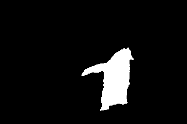
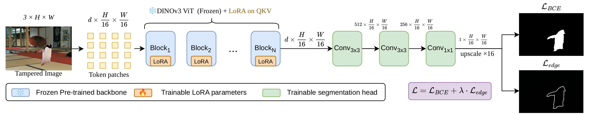

# DINOv3 Beats Specialized Detectors: A Simple Foundation Model Baseline for Image Forensics

[](LICENSE)
[](https://www.python.org/)

> **TL;DR** — Freeze DINOv3, inject LoRA on QKV, attach a 3-conv head. With only **9.1 M trainable parameters**, this simple recipe outperforms all prior specialized detectors on both the CAT-Net and MVSS-Net evaluation protocols.

<p align="center">
  
  &nbsp;&nbsp;→&nbsp;&nbsp;
  
</p>
<p align="center"><em>Left: tampered image. Right: predicted forgery mask.</em></p>

---

## Highlights

- **State-of-the-art** avg pixel-F1 on CAT-Net protocol: **0.847** (vs. 0.677 prior SOTA)
- Only **9.1 M trainable parameters** — LoRA on QKV + 3-conv head
- **Frozen backbone** — no catastrophic forgetting, no collapse on small datasets
- **Simple architecture** — no specialized forensic components, no frequency analysis, no attention manipulation

---

## Architecture

<p align="center">
  
</p>

A frozen DINOv3 ViT backbone with LoRA injected on QKV projections produces dense patch tokens, which are reshaped into a 2D feature map and decoded by a lightweight convolutional segmentation head into a pixel-level manipulation mask. The decoder applies Conv3×3→BN→ReLU (×2), then Conv1×1→Sigmoid, followed by bilinear upsampling to the original input resolution.

---

## Results

### CAT-Net Protocol (4-dataset avg pixel-F1)

*Training: CASIA-v2 + FantasticReality + IMD2020 + TampCOCO. Test: CASIAv1 / Columbia / NIST16 / Coverage.*

| | Method | CASIAv1 | Columbia | NIST16 | Coverage | **Avg F1** |
|---|---|---|---|---|---|---|
| Prior | MVSS-Net | 0.583 | 0.740 | 0.336 | 0.486 | 0.536 |
| Prior | PSCC-Net | 0.630 | 0.884 | 0.346 | 0.448 | 0.577 |
| Prior | CAT-Net | 0.808 | **0.915** | 0.252 | 0.427 | 0.601 |
| Prior | TruFor | 0.818 | 0.885 | 0.348 | 0.457 | 0.627 |
| Prior | Mesorch | **0.840** | 0.890 | **0.392** | **0.586** | **0.677** |
| ViT-S | DINOv3 + LoRA r=32 | 0.787 | 0.923 | 0.462 | 0.646 | 0.704 |
| ViT-S | DINOv3 + LoRA r=64 | 0.803 | 0.918 | 0.457 | 0.671 | 0.712 |
| ViT-S | DINOv3 + Full FT | 0.704 | 0.887 | 0.400 | 0.531 | 0.630 |
| ViT-B | DINOv3 + LoRA r=32 | 0.840 | 0.938 | 0.565 | 0.715 | 0.764 |
| ViT-B | DINOv3 + LoRA r=64 | 0.863 | 0.904 | 0.570 | 0.784 | 0.780 |
| ViT-B | DINOv3 + Full FT | 0.815 | 0.918 | 0.518 | 0.652 | 0.726 |
| ViT-L | DINOv3 + LoRA r=32 | 0.907 | **0.941** | **0.636** | **0.905** | **0.847** |
| ViT-L | DINOv3 + LoRA r=64 | **0.908** | 0.927 | 0.633 | 0.882 | 0.837 |
| ViT-L | DINOv3 + Full FT | 0.882 | 0.938 | 0.616 | 0.866 | 0.826 |

### MVSS-Net Protocol (5-dataset avg pixel-F1)

*Training: CASIA-v2 only (5,123 images). Test: CASIAv1 / Columbia / NIST16 / Coverage / IMD2020.*

| | Method | Coverage | Columbia | NIST16 | CASIAv1 | IMD2020 | **Avg F1** |
|---|---|---|---|---|---|---|---|
| Prior | Mantra-Net | 0.090 | 0.243 | 0.104 | 0.125 | 0.055 | 0.123 |
| Prior | ObjectFormer | 0.294 | 0.336 | 0.173 | 0.429 | 0.173 | 0.281 |
| Prior | PSCC-Net | 0.231 | 0.604 | 0.214 | 0.378 | 0.235 | 0.333 |
| Prior | NCL-IML | 0.225 | 0.446 | 0.260 | 0.502 | 0.237 | 0.334 |
| Prior | MVSS-Net | 0.259 | 0.386 | 0.246 | 0.534 | 0.279 | 0.341 |
| Prior | CAT-Net | 0.296 | 0.584 | 0.269 | 0.581 | 0.273 | 0.401 |
| Prior | IML-ViT | **0.435** | 0.780 | 0.331 | **0.721** | **0.327** | 0.519 |
| Prior | TruFor | 0.419 | **0.865** | **0.324** | **0.721** | 0.322 | **0.530** |
| ViT-S | DINOv3 + LoRA r=32 | 0.363 | 0.646 | 0.324 | 0.622 | 0.346 | 0.460 |
| ViT-S | DINOv3 + LoRA r=64 | 0.403 | 0.721 | 0.343 | 0.672 | 0.373 | 0.502 |
| ViT-S | DINOv3 + Full FT | 0.154 | 0.364 | 0.189 | 0.209 | 0.186 | 0.221 |
| ViT-B | DINOv3 + LoRA r=32 | 0.211 | 0.443 | 0.256 | 0.543 | 0.296 | 0.350 |
| ViT-B | DINOv3 + LoRA r=64 | 0.545 | 0.820 | 0.465 | 0.761 | 0.475 | 0.613 |
| ViT-B | DINOv3 + Full FT | 0.163 | 0.136 | 0.093 | 0.078 | 0.082 | 0.110 |
| ViT-L | DINOv3 + LoRA r=32 | **0.822** | **0.943** | 0.589 | 0.867 | 0.628 | 0.770 |
| ViT-L | DINOv3 + LoRA r=64 | 0.820 | 0.915 | **0.621** | **0.873** | **0.641** | **0.774** |
| ViT-L | DINOv3 + Full FT | 0.679 | 0.842 | 0.532 | 0.852 | 0.499 | 0.681 |

---

## Pretrained Weights

### CAT-Net Protocol

| Config | Avg F1 | Trainable params | Download |
|---|---|---|---|
| ViT-S LoRA r=32 | 0.704 | 1.4 M | [Google Drive](https://drive.google.com/drive/folders/1YtHrQ9-j74OK3XzhYVsIKZZAodhcCNsS) |
| ViT-S LoRA r=64 | 0.712 | 2.0 M | [Google Drive](https://drive.google.com/drive/folders/1z--C_sdNFi4z7MTOnkT-Rjv7Bx99kwcT) |
| ViT-S Full FT   | 0.630 | ~22 M | [Google Drive](https://drive.google.com/drive/folders/1HgAHyNVeNfLYyUG-7xtJJvqixGBgXoDy) |
| ViT-B LoRA r=32 | 0.764 | 4.5 M | [Google Drive](https://drive.google.com/drive/folders/1pYOSBYGHg3Aby8MtvaXAXV5IhFdN7JYw) |
| ViT-B LoRA r=64 | 0.780 | 5.7 M | [Google Drive](https://drive.google.com/drive/folders/16c87obUh0VG0wzQP5lOWuEkjyLwo6toP) |
| ViT-B Full FT   | 0.726 | ~89 M | [Google Drive](https://drive.google.com/drive/folders/1A-0Mmf_vXDHeHnfzsuUoSjU9LZOk8Yf4) |
| ViT-L LoRA r=32 | **0.847** | 9.1 M | [Google Drive](https://drive.google.com/drive/folders/125leLub_M-lICa1ILTOL-FCz4ZY6eutj) |
| ViT-L LoRA r=64 | 0.837 | 12.2 M | [Google Drive](https://drive.google.com/drive/folders/1ygQjiQqtd2C7aGL6TdPh7hQC-bXw4k45) |
| ViT-L Full FT   | 0.826 | ~309 M | [Google Drive](https://drive.google.com/drive/folders/1PFpkmihTNFLdp5U3AFMVN92Sy3FxhNXd) |

### MVSS-Net Protocol

| Config | Avg F1 | Trainable params | Download |
|---|---|---|---|
| ViT-S LoRA r=32 | 0.460 | 1.4 M | [Google Drive](https://drive.google.com/drive/folders/1axjOKlyqA9h3dacFXm9CVcLC0nN1Tfh3) |
| ViT-S LoRA r=64 | 0.502 | 2.0 M | [Google Drive](https://drive.google.com/drive/folders/1wl6wcFobnTouLP5pYoh4MbaGliV5A6ul) |
| ViT-S Full FT   | 0.221 | ~22 M | [Google Drive](https://drive.google.com/drive/folders/194-p4nN-H7RMdvvavRomctCXw9XFggUz) |
| ViT-B LoRA r=32 | 0.350 | 4.5 M | [Google Drive](https://drive.google.com/drive/folders/1IhIjZJ7uT54T5ondo-44CgA8F0ZdCuou) |
| ViT-B LoRA r=64 | 0.613 | 5.7 M | [Google Drive](https://drive.google.com/drive/folders/1HGIaH18RhKyiXOKE4uHP3fyhjHK4xpGo) |
| ViT-B Full FT   | 0.110 | ~89 M | [Google Drive](https://drive.google.com/drive/folders/1lW5ivmDONuKODOlNHvXfPgsvtOGGrtJp) |
| ViT-L LoRA r=32 | 0.770 | 9.1 M | [Google Drive](https://drive.google.com/drive/folders/17QQJ2HNtn8SCgjkyZgc-1Yr65z6T48Rs) |
| ViT-L LoRA r=64 | **0.774** | 12.2 M | [Google Drive](https://drive.google.com/drive/folders/1hallC_SjOBC6lHtq1sJfD-x3mjI9WyjU) |
| ViT-L Full FT   | 0.681 | ~309 M | [Google Drive](https://drive.google.com/drive/folders/1tXZlglmtEboLNqyRrNt-Ax5MN2m1_Wgy) |

DINOv3 backbone weights: see the [DINOv3 / DINOv2 repository](https://github.com/facebookresearch/dinov2).

---

## Quick Start — Inference

```bash
pip install torch peft Pillow numpy
```

```python
from inference import predict

mask = predict(
    image_path="path/to/image.jpg",
    checkpoint_path="checkpoints/cat_vitl_lora_r32.pth",
    dinov3_repo="path/to/dinov3",
    dinov3_weights="path/to/dinov3_vitl16_pretrain.pth",
    model_type="dinov3_vitl16",
    lora_rank=32,
)
mask.save("predicted_mask.png")
```

Or via command line:

```bash
python inference.py \
    --image photo.jpg \
    --checkpoint checkpoints/cat_vitl_lora_r32.pth \
    --dinov3_repo path/to/dinov3 \
    --dinov3_weights path/to/dinov3_vitl16_pretrain.pth \
    --model_type dinov3_vitl16 \
    --lora_rank 32 \
    --output mask.png
```

---

## Training

### 1. Install dependencies

```bash
pip install torch peft imdlbenco
```

### 2. Download datasets

Follow [IMDLBenCo dataset preparation](https://github.com/scu-zjz/IMDLBenCo) to obtain CASIA-v2, FantasticReality, IMD2020, TampCOCO (CAT protocol) or CASIA-v2 alone (MVSS protocol).

### 3. Edit config

```bash
# Set data_path, test_data_path, dinov3_repo_path, dinov3_weights_path
vim configs/cat_lora_vitl_r32.yaml
```

Training hyperparameters (shared across all configs): AdamW optimizer, lr = 3e-4, cosine annealing schedule, 5 warmup epochs, 100 total epochs, effective batch size = 240 (via gradient accumulation), images resized to 512x512.

### 4. Launch training

```bash
# Single GPU
bash scripts/train.sh configs/cat_lora_vitl_r32.yaml

# Multi-GPU (e.g., 4 GPUs)
NPROC=4 bash scripts/train.sh configs/cat_lora_vitl_r32.yaml
```

Checkpoints and logs are saved to `output/<config_name>/`.

---

## Model Zoo (programmatic import)

The models can be imported and used without IMDLBenCo:

```python
from models import DINOv3ForensicsLoRA

model = DINOv3ForensicsLoRA(
    dinov3_repo_path="./dinov3",
    dinov3_weights_path="./dinov3_vitl16_pretrain.pth",
    dinov3_model_type="dinov3_vitl16",
    lora_rank=32,
    lora_alpha=64,
)

# Inference
import torch
image = torch.randn(1, 3, 512, 512)
mask = model.predict(image)   # (1, 1, 512, 512), values in [0, 1]

# Load from checkpoint
model = DINOv3ForensicsLoRA.from_pretrained(
    "checkpoints/cat_vitl_lora_r32.pth",
    dinov3_repo_path="./dinov3",
    dinov3_weights_path="./dinov3_vitl16_pretrain.pth",
    dinov3_model_type="dinov3_vitl16",
    lora_rank=32, lora_alpha=64,
)
```

---

## Citation

```bibtex
@article{yu2025dinov3iml,
  title   = {DINOv3 Beats Specialized Detectors: A Simple Foundation Model Baseline for Image Forensics},
  author  = {Yu, Jieming and Wang, Zhuohan and Ma, Xiaochen},
  journal = {arXiv preprint},
  year    = {2025},
}
```

---

## Acknowledgements

- [DINOv2 / DINOv3](https://github.com/facebookresearch/dinov2) (Facebook Research) for the pretrained ViT backbone
- [IMDLBenCo](https://github.com/scu-zjz/IMDLBenCo) for the image manipulation detection training framework
- [PEFT](https://github.com/huggingface/peft) for the LoRA implementation
